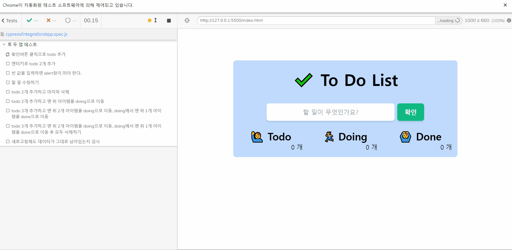

# Vanilla To Do List (진행 중)

과거에 진행했던 <네이버 부스트 코스 - 풀스택 투두리스트 구현하기> 미션을 다시 진행합니다.

(테스트 중인 모습)

👋 [프로젝트 링크](#)

<table>
    <thead>
        <tr>
            <th colspan="2" style="text-align: center">
                🛠 Skills & Tools
            </th>
        </tr>
    </thead>
    <tbody>
        <tr>
            <td style="text-align: center">Language</td>
            <td>Vanilla JS</td>
        </tr>
        <tr>
            <td style="text-align: center">Style & Layout</td>
            <td>HTML / TailWind CSS</td>
        </tr>
        <tr>
            <td style="text-align: center">Test</td>
            <td>Cypress</td>
        </tr>
        <tr>
            <td style="text-align: center">API server</td>
            <td><a href="#">Node JS API server</a></td>
        </tr>
        <tr>
            <td style="text-align: center">keywords</td>
            <td><strong>Vanilla JS</strong> | <strong>TailWind CSS</strong> | <strong>Web API</strong> | <strong>DOM API</strong> | <strong>상태관리</strong> | <strong>로컬스토리지</strong> | <strong>AJAX</strong></td>
        </tr>
    </tbody>
</table>

 

# ❓ 이 프로젝트를 하는 목적

✔ 과거 진행한 코드가 엉망이었기 때문에...

✔ 바닐라 자바스크립트에 좀 더 익숙해지기 위해

✔ JSP 대신 nodeJS로 API 서버를 만들어서 사용해보기 위해

✔ Ajax와 비동기 연습을 위해

✔ TDD 연습을 위해

✔ 리팩터링 연습을 위해

✔ 타입스크립트 마이그레이션 연습을 위해

 

# 🎯 요구사항

## 추가

◻ from 제출 시 새로 고침이 되지 않도록 한다.

◻ 할 일을 입력하고 확인 버튼을 클릭하면 todo 목록에 추가된다.

◻ 할 일을 입력하고 엔터키를 누르면 todo 목록에 추가된다.

◻ 빈 값이라면 추가하지 않는다.

◻ 추가 한 이후에 input은 빈 값으로 초기화 한다.

◻ 추가하면 개수가 업데이트 된다.

## 수정

◻ 🖊️ 버튼을 클릭하면 수정할 수 있다.

◻ `prompt` 인터페이스를 활용한다.

## 삭제

◻ 개수가 업데이트 된다.

◻ X 버튼을 누르면 삭제된다.

◻ `confirm` 인터페이스를 활용한다.

## 이동

◻ 개수가 업데이트 된다.

◻ → 버튼을 누르면 todo는 doing으로, doing은 done으로 이동한다.

◻ `confirm` 인터페이스를 활용한다.

## ✅ Step 1

기본 요구사항을 구현한다.

## ✅ Step 2

로컬스토리지를 이용하여 새로고침해도 데이터가 남아있도록 한다.

## ✅ Step 3

NodeJS API 서버를 만들고, 만든 API를 이용하여 로컬스토리지 없이 Ajax 비동기 통신으로 전환한다.

 

# 과정

<table>
    <thead>
        <tr>
            <th colspan="2" style="text-align: center">
                생각하고 정리하기
            </th>
        </tr>
    </thead>
    <tbody>
        <tr>
            <td style="text-align: center">🤔</td>
            <td><a href="https://www.notion.so/ryong9rrr/b6e56085018f41b1ae5a37c538e07d65">요구 사항 분석</a></td>
        </tr>
        <tr>
            <td style="text-align: center">💡</td>
            <td><a href="#">회고</a></td>
        </tr>
    </tbody>
</table>
