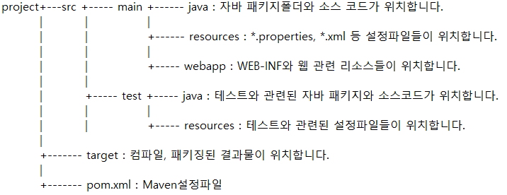
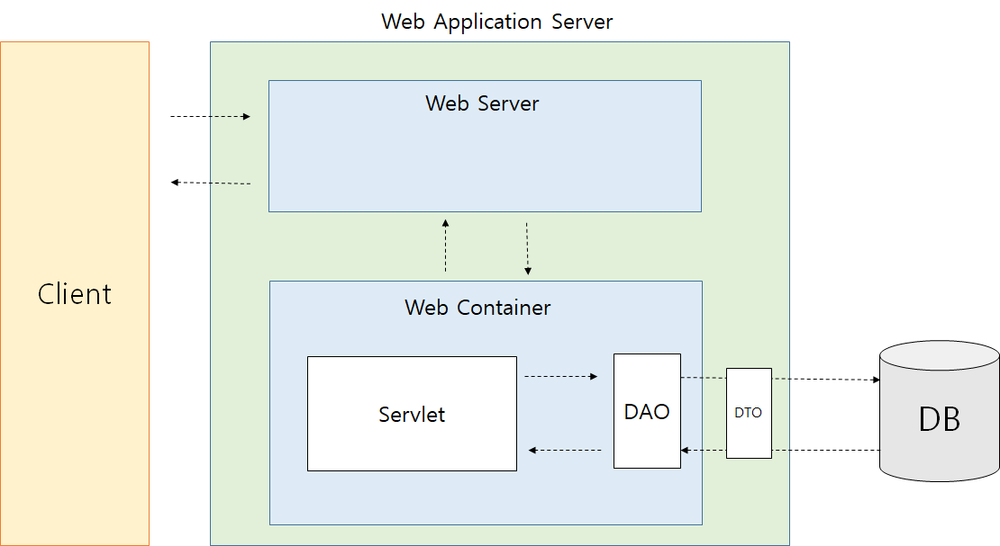

# 네이버 부스트코스 풀스택

1. aboutme
2. todo-list

---

# #2 todo-list

## 📖 목차

- #1. 디렉토리 구조<br />
  #1.1. javaWAS
- #2. 개발환경세팅<br />
  #2.1. maven 프로젝트 생성
- #3. jst 버전 업그레이드
- #4. mysql
- #5. DTO (Data Transfer Object)
- #6. DAO (Data Access Object)

---

### #1. 디렉토리 구조



#### #1.1 javaWAS 구조



### #2. 개발환경세팅

#### #2.1. maven 프로젝트 생성

1. File - new - maven - Filter > org.apache.maven.archetypes

- groupId

  - groupId는 당신의 프로젝트를 모든 프로젝트 사이에서 고유하게 식별하게 해 주는 것이다.

  - 따라서, groupId에는 네이밍 스키마를 적용하도록 한다.

    - groupId는 package 명명 규칙을 따르도록 한다.
    - 즉, 최소한 당신이 컨트롤하는 도메인 네임이어야 한다.
    - 하위 그룹은 얼마든지 추가할 수 있다.
    - 예: `org.apache.maven` , `org.apache.commons`

  - 프로젝트 구조를 사용하면 잘 구분되는 groupId를 만들 수 있다.

    - 현재 프로젝트가 다중 모듈 프로젝트라면, 부모 groupId에 현재 프로젝트의 식별자를 추가하는 방식.

    - 예: `org.apache.maven` , `org.apache.maven.plugins` , `org.apache.maven.reporting`

- artifactId

  - artifactId는 버전 정보를 생략한 `jar`파일의 이름이다.

    - 이름은 원하는 것으로 아무거나 정해도 괜찮다.
    - 단, 소문자로만 작성할 것.
    - 단, 특수문자는 사용하지 않는다.

  - 만약 써드 파티 `jar` 파일이라면, 할당된 이름을 사용해야 한다.

    - 예: `maven` , `commons-math`

2. 만들고 main폴더 아래에 java, resources 폴더 생성

3. 개발환경세팅

- pom.xml

  ```
  <properties>
    <!-- web.xml 파일을 삭제해도 eclipse에서 오류가 발생하지 않는다. -->
    <failOnMissingWebXml>false</failOnMissingWebXml>
  </properties>

  <!-- mysql과 같은 version으로 -->
  <dependency>
    <groupId>mysql</groupId>
    <artifactId>mysql-connector-java</artifactId>
    <version>8.0.23</version>
  </dependency>

  <!-- json 라이브러리 databind jackson-core, jackson-annotaion에 의존성이 있다. -->
  <dependency>
    <groupId>com.fasterxml.jackson.core</groupId>
    <artifactId>jackson-databind</artifactId>
    <version>2.9.4</version>
  </dependency>

  <dependency>
    <groupId>javax.servlet</groupId>
    <artifactId>javax.servlet-api</artifactId>
    <version>3.1.0</version>
    <scope>provided</scope>
  </dependency>

  <dependency>
    <groupId>javax.servlet</groupId>
    <artifactId>jstl</artifactId>
    <version>1.2</version>
  </dependency>


  ```

### #3. jst 버전 업그레이드

- web.xml 수정

```
<?xml version="1.0" encoding="UTF-8"?>
<web-app xmlns="http://xmlns.jcp.org/xml/ns/javaee" xmlns:xsi="http://www.w3.org/2001/XMLSchema-instance"
         xsi:schemaLocation="http://xmlns.jcp.org/xml/ns/javaee http://xmlns.jcp.org/xml/ns/javaee/web-app_3_1.xsd" version="3.1">
  <display-name>Archetype Created Web Application</display-name>
</web-app>

```

- org.elclipse.wst.common.project.facet.core.xml<br /> jst 👉 3.1 로 변경

- pom/xml 에 플러그인 추가

```

  <plugins>
    <plugin>
      <groupId>org.apache.maven.plugins</groupId>
      <artifactId>maven-compiler-plugin</artifactId>
      <version>3.1</version>
      <configuration>
        <source>1.8</source>
        <target>1.8</target>
      </configuration>
    </plugin>
  </plugins>

```

### #4. mysql

1. 데이터베이스 생성

   `CREATE DATABASE study_db default CHARACTER SET UTF8;`

2. 유저생성

   `CREATE USER todo_user@localhost identified by 'todo';`

3. 유저에게 권한 부여

   `GRANT ALL PRIVILEGES ON todo_db.* TO todo_user@localhost;`

4. `flush privileges;`
5. `exit`
6. 확인 `mysql -h127.0.0.1 -utodo_user -p`

- database를 쓰겠다

  `use 데이터베이스이름;`

  ex) `use todo_db;`

- 테이블을 보겠다

  `show tables;`

- table 생성

  `CREATE TABLE todo ( id BIGINT(20) UNSIGNED NOT NULL AUTO_INCREMENT, title VARCHAR(255) NOT NULL, name VARCHAR(100) NOT NULL, sequence INT(1) NOT NULL, type VARCHAR(20) DEFAULT 'TODO', regdate DATETIME DEFAULT NOW(), PRIMARY KEY (id) );`

- table 보기

  `desc 테이블이름;`

- 데이터 하나 넣어주기

  `INSERT into todo (title, name, sequence) values ("java공부", "상윤", "1");`

- 데이터 확인, 추가, 삭제

  `SELECT * FROM todo;`

  <table>
  <th>id</th>
  <th>title</th>
  <th>name</th>
  <th>sequence</th>
  <th>type</th>
  <th>regdate</th>
  <tr>
  	<td>1</td>
  	<td>java공부</td>
  	<td>상윤</td>
  	<td>1</td>
  	<td>TODO</td>
  	<td>2021-04-11 00:55:50</td>
  </tr>
  </table>

  - id 값은 NOT NULL 이지만 AUTO_INCREMENT 로 인해 자동으로 추가됨.

  - test

        `INSERT into todo (id,title, name, sequence) values (100, "test", "상윤", "3");`

      <table>
    <th>id</th>
    <th>title</th>
    <th>name</th>
    <th>sequence</th>
    <th>type</th>
    <th>regdate</th>
    <tr>
    	<td>1</td>
    	<td>java공부</td>
    	<td>상윤</td>
    	<td>1</td>
    	<td>TODO</td>
    	<td>2021-04-11 00:55:50</td>
    </tr>
    <tr>
    	<td>100</td>
    	<td>test</td>
    	<td>상윤</td>
    	<td>3</td>
    	<td>TODO</td>
    	<td>2021-04-11 01:04:35</td>
    </tr>
    </table>

- `DELETE FROM todo where id=100;`

  삭제하고 SELECT 로 확인해보면 삭제된 것을 알 수 있음.
  <table>
  <th>id</th>
  <th>title</th>
  <th>name</th>
  <th>sequence</th>
  <th>type</th>
  <th>regdate</th>
  <tr>
  	<td>1</td>
  	<td>java공부</td>
  	<td>상윤</td>
  	<td>1</td>
  	<td>TODO</td>
  	<td>2021-04-11 00:55:50</td>
  </tr>
  </table>

### #5. DTO (Data Transfer Object)

- DTO 란?

  데이터베이스의 자료를 자바에서 쓸 수 있도록 전환해주는 클래스를 정의한다.

### #6. DAO (Data Access Object)

- DAO 란?

  데이터베이스의 CRUD를 모듈화 한 것

- mysql(ver 8.0.23)과 연동 시

  - dburl = "jdbc:mysql://localhost:3306/데이터베이스이름?useSSL=false"

  - `Class.forName("com.mysql.cj.jdbc.Driver");`
